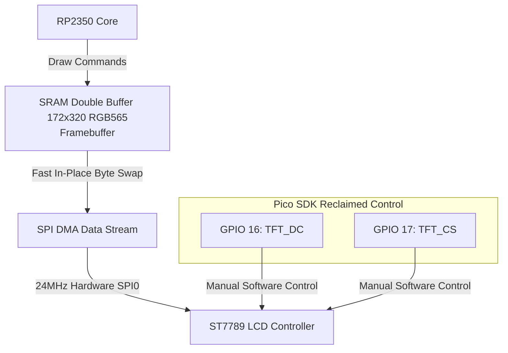

# 🌌 Waveshare RP2350-LCD-1.47-A Sci-Fi AI Agent Dashboard

A premium, zero-dependency, ultra-high-performance sci-fi animated dashboard for the **Waveshare RP2350-LCD-1.47-A** development board (featuring a 1.47-inch 172x320 pixels IPS display, powered by the Raspberry Pi RP2350 microcontroller).

This project features a fully self-contained graphics rendering engine and display driver written directly using Pico SDK hardware registers and SPI, demonstrating how to achieve **~50 FPS flicker-free animation** without external graphical libraries.

---

## ✨ Features

* **📦 Zero Dependencies:** No library installations required! No `Adafruit_GFX`, `Adafruit_ST7789`, `TFT_eSPI`, or any other heavy library is needed. Everything is compiled directly from a single optimized sketch.
* **⚡ High-Speed Direct SPI Driver:** Custom implementation of the ST7789 display controller utilizing the RP2350's hardware SPI0 interface running at **24MHz**.
* **🔧 Pico SDK Hardware Reclaiming:** Solves critical RP2350 pin-mux conflicts where the hardware SPI0 block automatically claims GPIO 16 (DC) and GPIO 17 (CS) by programmatically reclaiming them as standard software SIO GPIO pins using Pico SDK registers.
* **🖼️ Double-Buffered Framebuffer:** Full-screen double buffering (110,080 bytes) residing in the RP2350's 520KB SRAM for 100% flicker-free graphics.
* **🔄 Fast In-Place Byte Swapping:** Zero-copy, in-place bitwise byte-swapping to convert Little-Endian coordinates to Big-Endian (required by ST7789) during DMA/SPI streaming, and immediate reversal for seamless frame calculations.
* **🎨 Vector Graphics Engine:** Custom lightweight implementations of:
  * Bresenham's Line Drawing Algorithm.
  * Filled/Hollow Circles and Rounded Rectangles.
  * Custom 5x7 Monospaced ASCII Font Array (1.2KB embedded in flash memory).
* **🤖 Futuristic AI Mascot Animations:**
  * Interactive rotating holographic tech-rings with dual-direction segments and pulsed halo glow.
  * Gentle mascot "breathing" scale using sine-wave transformations.
  * State-machine controlled eye-blinking behavior.
  * Real-time 23-bar Audio Spectrometer mockup with Gaussian envelope dampening and horizontal cyan-to-magenta gradients.
  * Animated "Listening..." console log, battery charging status bar, and ambient cosmic starfield.

---

## 🔌 Hardware Pin Mapping

The Waveshare RP2350-LCD-1.47-A board routes the onboard IPS LCD to the RP2350 pins as follows:

| TFT Pin Name | RP2350 GPIO Pin | Function / Role |
|:---|:---:|:---|
| **TFT_DC** | **GPIO 16** | Data / Command Selection (SIO Reclaimed) |
| **TFT_CS** | **GPIO 17** | SPI Chip Select (SIO Reclaimed) |
| **TFT_CLK** | **GPIO 18** | SPI Clock (SCK) |
| **TFT_MOSI**| **GPIO 19** | SPI Master-Out Slave-In (MOSI / TX) |
| **TFT_RST** | **GPIO 20** | Hardware Reset Pin |
| **TFT_BL**  | **GPIO 21** | Backlight Control (Active HIGH) |

---

## 🏗️ System Architecture



---

## ⚙️ Key Technical Implementations

### 1. Reclaiming Hardware SPI Pins
Normally, calling `SPI.begin()` on RP2350 attempts to lock pins 16, 17, 18, and 19 for the hardware SPI block. However, the ST7789 screen needs **CS** and **DC** as manually controlled software GPIO pins. The driver programmatically intercepts and reclaims these pins:
```cpp
gpio_init(TFT_CS);
gpio_set_dir(TFT_CS, GPIO_OUT);
gpio_put(TFT_CS, 1);

gpio_init(TFT_DC);
gpio_set_dir(TFT_DC, GPIO_OUT);
gpio_put(TFT_DC, 1);
```

### 2. In-Place Byte Swapping for DMA Stream
Since the RP2350 CPU is Little-Endian and the ST7789 display controller requires Big-Endian RGB565 colors, we must swap the high and low bytes of each pixel before shipping them over SPI. To avoid allocating a second massive memory buffer, we do this in-place:
```cpp
// Fast in-place byte swap to big-endian
for (uint32_t i = 0; i < len; i++) {
  buf[i] = (buf[i] >> 8) | (buf[i] << 8);
}

// ... SPI Transmission ...

// Fast in-place byte swap back to native little-endian for next frame
for (uint32_t i = 0; i < len; i++) {
  buf[i] = (buf[i] >> 8) | (buf[i] << 8);
}
```

---

## 🚀 How to Run the Project

1. **Install Arduino IDE** (v2.0 or newer recommended).
2. **Add Raspberry Pi Pico Board Support:**
   * Go to **File > Preferences**.
   * In **Additional Boards Manager URLs**, paste: `https://github.com/earlephilhower/arduino-pico/releases/download/global/package_rp2040_index.json`
   * Go to **Tools > Board > Boards Manager**, search for **Pico**, and install **Raspberry Pi Pico/RP2040** by Earle F. Philhower, III.
3. **Select Board and Configuration:**
   * **Board:** Select **Generic RP2350** (or similar RP2350 target).
   * **C++ Options:** Ensure default options are kept.
4. **Compile & Upload:**
   * Connect your Waveshare RP2350-LCD-1.47-A board to your computer via USB.
   * Hold the **BOOT** button, press the **RESET** button, and release **BOOT** to enter USB Mass Storage mode.
   * Choose the correct port in Arduino IDE and click **Upload**.

---

## 📂 Project Structure

```bash
RP2350-LCD-1.47-A/
├── README.md               # This documentation file
└── RP2350-LCD-1.47-A.ino   # Core Arduino sketch containing the driver & drawing loop
```

---

## 🛡️ License

This project is open-source under the MIT License. Feel free to copy, modify, and use the zero-dependency SPI driver for your own high-performance RP2350 screen creations!